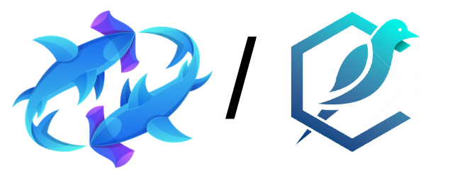

# Poolshark Report

> Copyright © 2023 by Canary Technologies Inc. All rights reserved.
>
> Apr 04, 2023
>
> by **Canary Technologies Inc.**

This report presents our engineering engagement with the Poolshark team on their range-bound liquidity protocol.

| Project Name    | Poolshark                          |
| --------------- | ------------------------------------------------ |
| Repository Link | https://github.com/poolsharks-protocol/range  |
| Commit Hash     |  First: b62dfe3;   Final: 389b640;               |
| Language        | Solidity                                         |
| Chain           | Arbitrum                                         |

## Service Scope

### Service Stages

Our auditing service includes the following two stages:

- Pre-Audit Consulting Service
- Smart Contract Auditing Service

1. **Pre-Audit Consulting Service**
   - [Protocol Security & Design Discussion Meeting]
   As a part of the audit service, the Canary Technologies team worked closely with the Poolshark development team to discuss potential vulnerabilities and smart contract development best practices in a timely fashion. The Canary Technologies team is very appreciative of establishing an efficient and effective communication channel with the Poolshark team, as new findings were exchanged promptly and fixes were deployed quickly, during the preliminary report stage.

2. **Smart Contract Auditing Service**
   The Canary Technologies team analyzed the entire project using a detailed-oriented approach to capture the fundamental logic and suggested improvements to the existing code. Details can be found under **Findings & Improvement Suggestions**.

### Methodology

- Code Assessment
  - We evaluate the overall quality of the code and comments as well as the architecture of the repository.
  - We help the project dev team improve the overall quality of the repository by providing suggestions on refactorization to follow the best practice of Web3 software engineering.
- Code Logic Analysis
  - We dive into the data structures and algorithms in the repository and provide suggestions to improve the data structures and algorithms for the lower time and space complexities.
  - We analyze the hierarchy among multiple modules and the relations among the source code files in the repository and provide suggestions to improve the code architecture with better readability, reusability, and extensibility.
- Business Logic Analysis
  - We study the technical whitepaper and other documents of the project and compare its specification with the functionality implemented in the code for any potential mismatch between them.
  - We analyze the risks and potential vulnerabilities in the business logic and make suggestions to improve the robustness of the project.
- Access Control Analysis
  - We perform a comprehensive assessment of the special roles of the project, including their authority and privileges.
  - We provide suggestions regarding the best practice of privilege role management according to the standard operating procedures (SOP).
- Off-Chain Components Analysis
  - We analyze the off-chain modules that are interacting with the on-chain functionalities and provide suggestions according to the SOP.
  - We conduct a comprehensive investigation for potential risks and hacks that may happen on the off-chain components and provide suggestions for patches.
 
### Audit Scope

Our auditing for Poolshark covered the repository:

- https://github.com/poolsharks-protocol/range: commit hash **[b62dfe37c372fe5847d2ab27f2782003b15a8658](https://github.com/poolsharks-protocol/range/tree/b62dfe37c372fe5847d2ab27f2782003b15a8658)**

## Project Summary

Poolshark Range pool is a concentrated liquidity pool supporting both fungible and non-fungible positions. Non-fungible positions uses ERC20 as position tokens which can be transferred and traded.

Architecture diagram:

## Findings & Improvement Suggestions

|Severity|**Total**|**Acknowledged**|**Resolved**|
|---|---|---|---|
|**High**|8|3|3|
|**Medium**|4|2|2|
|**Low**|5|2|1|
|**Informational**|6|3|3|
|**Undetermined**|4|3|0|

 ### **High**

### **Medium**

### **Low**

### **Informational**

### **Undetermined**

## Use Case Scenarios

The `RangePools` in the Poolshark Protocol is a set of smart contracts which implements bidirectional liquidity. Similar to Uniswap V3, Poolshark allows users to exchange cryptocurrencies and earn rewards by providing range-bound liquidity. Unlike other AMM products like Uniswap V2, users can accrue more fees by providing liquidity into a specific range.

## Access Control Analysis

There are two main privileged roles defined in the Poolshark Protocol, namely the `owner` and `_feeTo` addresses. Most of the privileged actions are only callable by them in the `RangePoolManager` contract. However, how fees are transferred from the different pools to the `_feeTo` address is that anyone can call the `collectFees()` function in the `RangePool` contract to transfer the fees from the pools to the defined `feeTo` address in the `RangePoolManager` contract. Other privileged actions for both roles are the following:

### **`owner`**
- Change the `owner` address.
- Enable fee tiers.
- Set the factory and top pool addresses.

### **`feeTo`**
- Change the `_feeTo` address.
- Collect fees from the defined pools.

## Appendix I: Severity Categories

| Severity | Description |
| --- | --- |
| High | Issues that are highly exploitable security vulnerabilities. It may cause direct loss of funds / permanent freezing of funds. All high severity issues should be resolved. |
| Medium | Issues that are only exploitable under some conditions or with some privileged access to the system. Users’ yields/rewards/information is at risk. All medium severity issues should be resolved unless there is a clear reason not to. |
| Low | Issues that are low risk. Not fixing those issues will not result in the failure of the system. A fix on low severity issues is recommended but subject to the clients’ decisions. |
| Informational | Issues that pose no risk to the system and are related to the security best practices. Not fixing those issues will not result in the failure of the system. A fix on informational issues or adoption of those security best practices-related suggestions is recommended but subject to clients’ decision. |

## Appendix II: Status Categories

| Severity | Description |
| --- | --- |
| High | Issues that are highly exploitable security vulnerabilities. It may cause direct loss of funds / permanent freezing of funds. All high severity issues should be resolved. |
| Medium | Issues that are only exploitable under some conditions or with some privileged access to the system. Users’ yields/rewards/information is at risk. All medium severity issues should be resolved unless there is a clear reason not to. |
| Low | Issues that are low risk. Not fixing those issues will not result in the failure of the system. A fix on low severity issues is recommended but subject to the clients’ decisions. |
| Informational | Issues that pose no risk to the system and are related to the security best practices. Not fixing those issues will not result in the failure of the system. A fix on informational issues or adoption of those security best practices-related suggestions is recommended but subject to clients’ decision. |

## Disclaimer

Verilog Solutions receives compensation from one or more clients for performing the smart contract and auditing analysis contained in these reports. The report created is solely for Clients and published with their consent. As such, the scope of our audit is limited to a review of code, and only the code we note as being within the scope of our audit detailed in this report. It is important to note that the Solidity code itself presents unique and unquantifiable risks since the Solidity language itself remains under current development and is subject to unknown risks and flaws. Our sole goal is to help reduce the attack vectors and the high level of variance associated with utilizing new and consistently changing technologies. Thus, Verilog Solutions in no way claims any guarantee of security or functionality of the technology we agree to analyze.

In addition, Verilog Solutions reports do not provide any indication of the technologies proprietors, business, business model, or legal compliance. As such, reports do not provide investment advice and should not be used to make decisions about investment or involvement with any particular project.  Verilog Solutions has the right to distribute the Report through other means, including via Verilog Solutions publications and other distributions. Verilog Solutions makes the reports available to parties other than the Clients (i.e., “third parties”) – on its website in hopes that it can help the blockchain ecosystem develop technical best practices in this rapidly evolving area of innovation.

